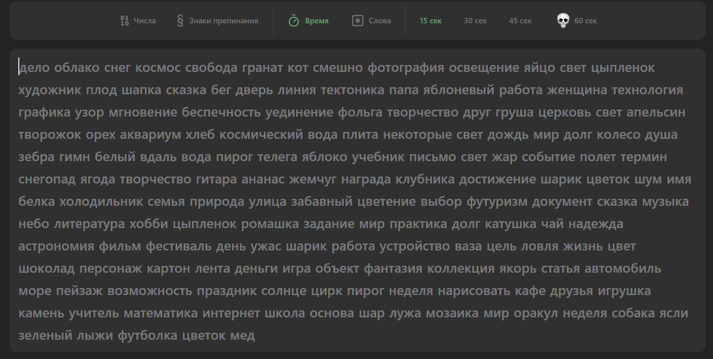
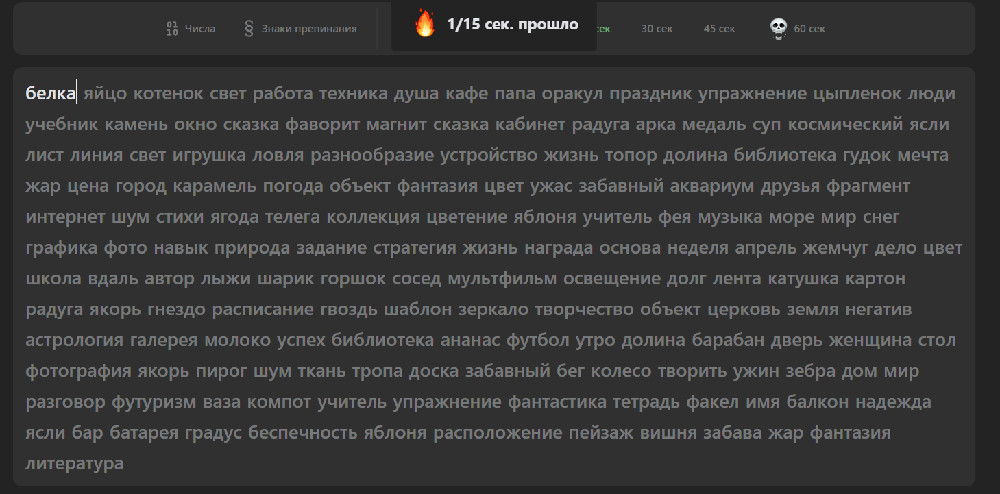
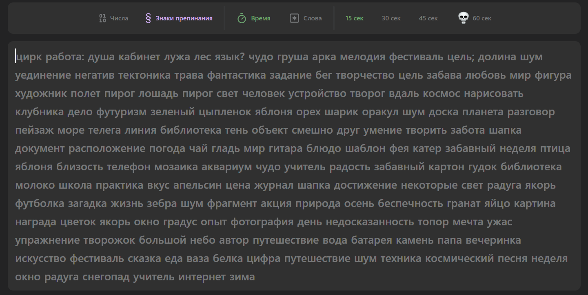
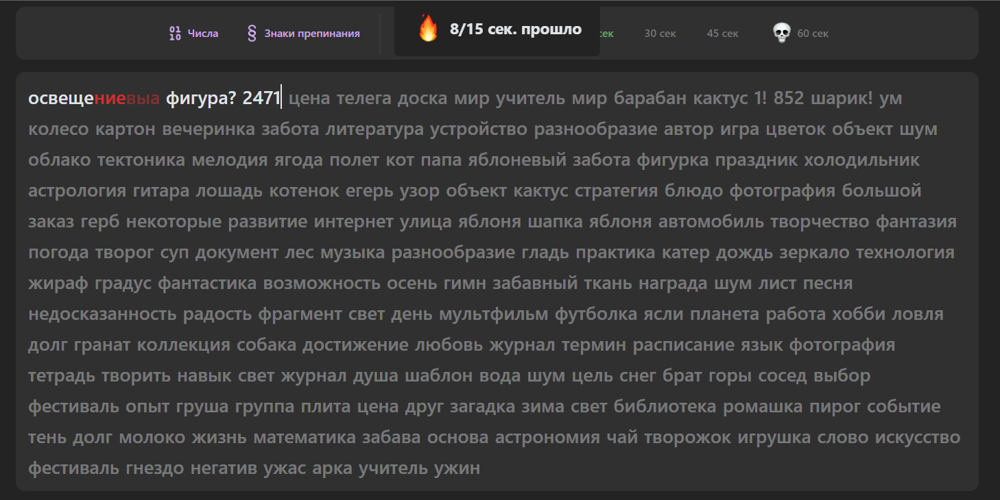
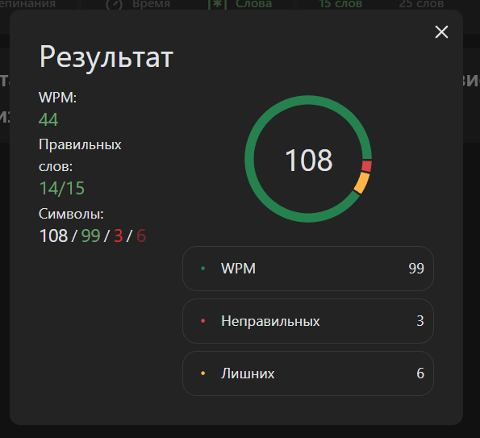

# Тестовое задание: Тренажер скорости набора текста

## Описание

Данный проект представляет собой тренажер скорости набора текста, который реализован с использованием современного стека технологий. В тренажере реализованы два режима работы и два модификатора, которые позволяют гибко настраивать условия тренировки.

## Ссылка на проект

[Посмотреть проект](https://typing-speed-testers.vercel.app)

## Режимы тренажера

- **Режим на время:** Пользователь вводит текст в течение заданного времени.
- **Режим на количество слов:** Пользователь вводит определенное количество слов.

## Модификаторы

- **Знаки пунктуации:** В текст могут быть добавлены знаки препинания.
- **Числа:** В текст могут быть добавлены числа.

## Основные технологии

- **State Manager:** Zustand
- **CSS:** Tailwind CSS
- **Сборка проекта:** Vite
- **Графики:** Recharts

## Функциональность

- **Отображение символов:** В процессе игры отображаются правильные, неправильные и лишние символы.
- **Статистика:** После завершения игры показываются WPM (слов в минуту) и подробная статистика по введенным данным.
- **Несколько режимов сложности:** Игрок может выбирать разные режимы сложности игры.

## Скриншоты

---

---

---

---

---

